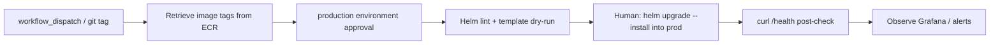

# Monitoring & production promotion runbook — Ecommerce App New

This runbook covers metrics, alerts, one-click production promotion, and rollback.
Live cluster apply / Grafana publish steps are **human-gated**; CI only validates
configs (promtool, Helm dry-run, dashboard JSON).

## Metrics overview

Both services expose Prometheus metrics at `/metrics`:

| Service  | Library     | Key metrics |
|----------|-------------|-------------|
| Backend  | `prom-client` | `http_request_duration_seconds` (Histogram), `http_request_errors_total`, `http_requests_total` |
| Frontend | `prom-client` (Express static server) | Same series with `service="frontend"` |

Health endpoints used by Kubernetes probes:

| Probe      | Path      | Meaning |
|------------|-----------|---------|
| Liveness   | `/health` | Process is alive |
| Readiness  | `/ready`  | Ready for traffic |

### Viewing metrics locally

```bash
# Backend
curl -s localhost:3000/metrics | head
curl -s localhost:3000/health
curl -s localhost:3000/ready

# Frontend (production server)
curl -s localhost:8080/metrics | head
curl -s localhost:8080/health
```

### Viewing metrics in-cluster (operator)

```bash
kubectl -n staging port-forward svc/ecommerce-staging-backend 3000:3000
curl -s localhost:3000/metrics | grep http_request_duration

kubectl -n staging port-forward svc/ecommerce-staging-frontend 8080:80
curl -s localhost:8080/metrics | grep http_request_duration
```

### Grafana

Import `monitoring/grafana/dashboards/ecommerce-overview.json` into Grafana
(Dashboard → Import → Upload JSON). Datasource UID expected: `prometheus`.

Dashboard panels: request rate, p95 latency (500 ms threshold), error ratio, CI failure gauge.

### Prometheus scrape

Scrape jobs live in `monitoring/prometheus/scrape-configs/ecommerce.yml`.
Merge into the cluster Prometheus config or reference via `additionalScrapeConfigs`.

SLO definitions: `monitoring/prometheus/slos/ecommerce-slos.yaml`
(99.9 % availability, 99 % of requests under 500 ms).

---

## Alert handling

Rules: `monitoring/prometheus/rules/alerts.yml`  
CRDs: `monitoring/kubernetes/prometheusrule-ecommerce.yaml` (namespace `monitoring`)

| Alert | Condition | Severity | First response |
|-------|-----------|----------|----------------|
| **CIJobFailure** | `CIJobFailure{job="build"} == 1` for 1m | critical | Open the failing GitHub Actions build; block prod promotion until green |
| **HighLatency** | p95 latency `service=~"backend\|frontend"` > 0.5s over 5m | warning | Check recent deploy, pod CPU/mem, dependency latency; roll back if tied to a release |
| **ServiceErrorBudgetBurn** | Error ratio > 1% for 10m | warning | Inspect 5xx logs; consider traffic shift / rollback |

### Response checklist

1. Acknowledge the alert in the on-call channel.
2. Open the Grafana overview dashboard and confirm the signal.
3. Correlate with the latest staging → prod promotion or CI run.
4. If latency/errors started at a promotion, follow **Rollback** below.
5. After mitigation, verify `/health` and `/ready` on both services and resolve the alert.

> Applying PrometheusRule CRDs (`kubectl apply -n monitoring -f …`) is withheld
> for a human with cluster RBAC. Validate first with `promtool check rules`.

---

## Promotion steps

Workflow: `.github/workflows/promote-prod.yml`

Triggers:

- **Manual:** Actions → “Promote to Production” → `workflow_dispatch`  
  - Input `version_tag` (optional)  
  - Input `confirm_promote` must be exactly `promote`
- **Tag:** push a tag matching `v*` or `prod-*`

### One-command trigger

```bash
gh workflow run promote-prod.yml \
  -f version_tag=<image-tag> \
  -f confirm_promote=promote
```

Or promote by tag:

```bash
git tag v1.2.3 && git push origin v1.2.3
```

### Pipeline diagram



### Job breakdown

1. **retrieve-image-tags** — AWS login, resolve tag (input → git tag → ECR `staging` → `latest`).
2. **helm-upgrade** — runs in GitHub Environment `production` (configure required reviewers).  
   Performs `helm lint` + `helm template` dry-run against `values-prod.yaml`.  
   **Live `helm upgrade --install` is withheld** for a human operator after approval.
3. **post-deploy-health-check** — `curl` to `PROD_HEALTH_URL` (default `https://ecommerce.example.com/health`).

### Human live apply (after CI dry-run + approval)

```bash
helm upgrade --install ecommerce-prod ./chart/staging \
  --namespace prod --create-namespace \
  -f ./chart/staging/values-prod.yaml \
  --set backend.image.tag=<tag> \
  --set frontend.image.tag=<tag>

kubectl -n prod get pods
curl -fsS https://ecommerce.example.com/health
curl -fsS https://ecommerce.example.com/api/health || curl -fsS https://ecommerce.example.com/ready
```

---

## Rollback

### Fast rollback (previous Helm revision)

```bash
helm history ecommerce-prod -n prod
helm rollback ecommerce-prod <REVISION> -n prod
kubectl -n prod rollout status deploy/ecommerce-prod-backend
kubectl -n prod rollout status deploy/ecommerce-prod-frontend
curl -fsS https://ecommerce.example.com/health
```

### Rollback to a known-good image tag

```bash
helm upgrade --install ecommerce-prod ./chart/staging \
  --namespace prod \
  -f ./chart/staging/values-prod.yaml \
  --set backend.image.tag=<known-good-tag> \
  --set frontend.image.tag=<known-good-tag>
```

### Verification after rollback

1. Pods Ready / probes succeeding (`kubectl get pods -n prod`).
2. `/health` and `/ready` return 200.
3. Grafana p95 latency and error ratio return to baseline.
4. HighLatency / error-budget alerts clear.

---

## Config inventory

```
monitoring/
  prometheus/
    rules/alerts.yml
    rules/recording.yml
    scrape-configs/ecommerce.yml
    slos/ecommerce-slos.yaml
  grafana/dashboards/ecommerce-overview.json
  kubernetes/prometheusrule-ecommerce.yaml
docs/RUNBOOK.md
.github/workflows/promote-prod.yml
chart/staging/values-prod.yaml
```

### Local verification (read-only)

```bash
./scripts/verify-monitoring.sh
./scripts/validate-helm-staging.sh
```
