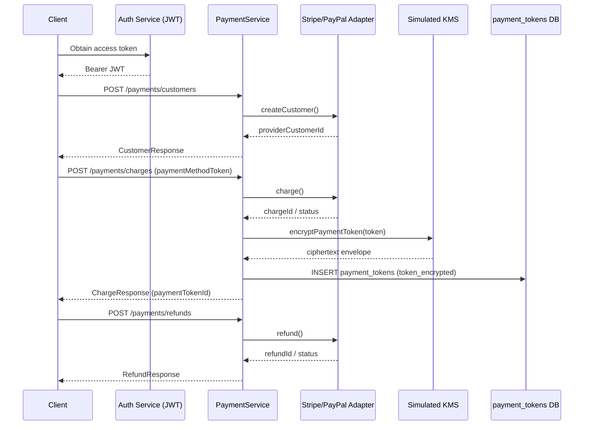

# Payment Service Design and Security Model

## Overview

The Payment Service is a unified abstraction layer for Ecommerce App New that
exposes three core operations:

| API | Purpose |
|-----|---------|
| `createCustomer` | Provision a customer with Stripe or PayPal |
| `chargeOrder` | Capture funds for an order using a provider payment-method token |
| `refund` | Fully or partially refund a prior successful charge |

Cardholder data (PAN, CVV, track data) **never** enters the application trust
boundary. Clients tokenize via provider SDKs; this service stores only
KMS-encrypted provider tokens in `payment_tokens.token_encrypted`.

This foundation supports Stripe and PayPal adapters behind a common
`PaymentProvider` interface and reduces PCI-DSS scope to SAQ A / A-EP style
flows when the client-side tokenization path is correctly implemented.

## API Contract

OpenAPI 3.0 specification: [`docs/openapi/payment-service.yaml`](./openapi/payment-service.yaml)

| Method | Path | Operation |
|--------|------|-----------|
| `POST` | `/payments/customers` | `createCustomer` |
| `POST` | `/payments/charges` | `chargeOrder` |
| `POST` | `/payments/refunds` | `refund` |

All endpoints require a Bearer JWT from the authentication service.

### Error codes

| HTTP | `error` code | When |
|------|--------------|------|
| 400 | `validation_error` | Invalid body or business rules |
| 401 | `unauthorized` | Missing/invalid JWT |
| 402 | `payment_declined` | Provider declined the instrument |
| 404 | `not_found` | Customer or charge missing |
| 409 | `conflict` | Idempotency / uniqueness conflict |
| 502 | `provider_error` | Upstream provider failure |
| 500 | `internal_error` | Unexpected failure |

## Data Model

Authoritative DDL: [`db/schema.sql`](../db/schema.sql)  
Migration: [`migrations/1750000000001_create-payment-tokens.ts`](../migrations/1750000000001_create-payment-tokens.ts)

### `customers`

Payment-domain customer rows keyed by provider customer id.

| Column | Type | Notes |
|--------|------|-------|
| `id` | UUID PK | Local identifier |
| `email` | CITEXT | Contact email |
| `display_name` | VARCHAR(255) | Optional |
| `provider` | ENUM(`stripe`,`paypal`) | Adapter used |
| `provider_customer_id` | VARCHAR(255) | Remote id |
| `created_at` / `updated_at` | TIMESTAMPTZ | Audit fields |

Unique constraint: `(provider, provider_customer_id)`.

### `payment_tokens`

| Column | Type | Notes |
|--------|------|-------|
| `id` | UUID PK | Local identifier |
| `customer_id` | UUID FK → `customers` | Cascade on delete |
| `token_encrypted` | TEXT | Simulated KMS envelope only |
| `created_at` / `updated_at` | TIMESTAMPTZ | Audit fields |

**Unique index** `payment_tokens_token_encrypted_uidx` on `token_encrypted`.

No PAN, CVV, expiry, or billing address columns exist by design.

## Security Controls

### Token encryption workflow (simulated KMS)

1. Client obtains a provider payment-method token via Stripe.js / PayPal SDK.
2. Client calls `chargeOrder` with that token (HTTPS + JWT).
3. `PaymentService` delegates charge to the provider adapter.
4. On success, `encryptPaymentToken()` wraps the token in an AES-256-GCM
   envelope (`v1:<iv>:<tag>:<ciphertext>`) using a key derived from
   `PAYMENT_KMS_SECRET` (stand-in for AWS KMS / GCP KMS / Vault).
5. Only the envelope is persisted in `payment_tokens.token_encrypted`.
6. Application logs record `customerId`, `chargeId`, and `paymentTokenId` —
   never plaintext tokens or the KMS secret.

### PCI-DSS considerations

| Control area | Approach |
|--------------|----------|
| Scope reduction | No CHD stored, processed, or transmitted by our servers when client SDKs tokenize |
| Data at rest | Encrypted tokens only; unique index prevents naive duplicates |
| Data in transit | TLS for all payment API traffic |
| Access control | JWT bearer auth on all payment routes |
| Auditability | Structured action logs with timestamps and outcome codes |
| Key management | Env-based secret for simulation; production must use managed KMS with rotation |
| Least privilege | Service accounts limited to payment schema tables |
| Forbidden storage | Explicit schema lint rejects PAN/CVV identifiers |

### Production hardening (human follow-up)

- Replace simulated KMS with a managed KMS and envelope encryption.
- Wire `PaymentStore` to PostgreSQL via the node-pg-migrate schema.
- Enable provider webhook signature verification (out of scope for this story).
- Run SAQ / QSA assessment before handling live card traffic.

## Service interaction diagram



## Module layout

```
backend/src/services/payment/
  PaymentService.ts          # createCustomer, chargeOrder, refund
  kms.ts                     # simulated AES-GCM envelope encryption
  errors.ts                  # typed PaymentError
  providers/
    PaymentProvider.ts       # adapter interface
    StripeProvider.ts        # stub
    PayPalProvider.ts        # stub
docs/openapi/payment-service.yaml
migrations/1750000000001_create-payment-tokens.ts
```

## Verification (read-only)

```bash
# Root — schema / migration static validation (no DB apply)
npm install
npm run verify:sql
npm run lint:openapi

# Backend — typecheck + unit tests
cd backend && npm install && npm test
```

Mutating `migrate up` against any live database is withheld for human operators.
