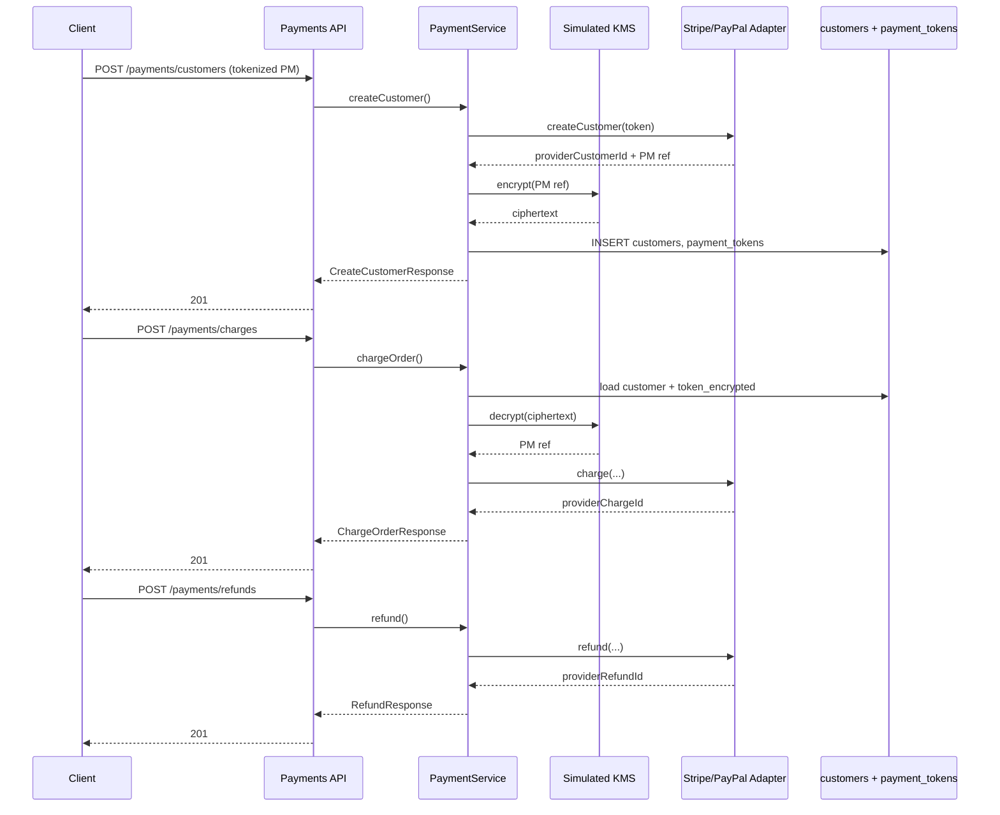

# Payment Service Design and Security Model

**Project:** Ecommerce App New  
**Epic:** Payment Gateway Integration & Security Hardening  
**Story:** Design and Implement Core Payment Service Abstraction  
**Story ID:** `efae3151-6a14-4c49-8304-686b79a2752f`

## Overview

The payment service is a unified abstraction layer that exposes three core
operations—`createCustomer`, `chargeOrder`, and `refund`—while delegating
provider-specific work to Stripe and PayPal adapters. The application never
accepts or stores raw cardholder data (PAN, CVV, track data). Clients send
**provider-issued payment method tokens** only. Tokens are encrypted with a
simulated KMS (AES-256-GCM) before persistence in `payment_tokens`.

This foundation enables PCI-DSS aligned flows (SAQ A / tokenization model):
the ecommerce app remains outside the card-data environment while providers
handle sensitive authentication data.

## API Contract

Machine-readable contract: [`openapi.yaml`](../openapi.yaml) (OpenAPI 3.0.3).

| Operation ID     | Method | Path                   | Auth   | Purpose                                      |
|------------------|--------|------------------------|--------|----------------------------------------------|
| `createCustomer` | POST   | `/payments/customers`  | Bearer | Provision provider customer + store token    |
| `chargeOrder`    | POST   | `/payments/charges`    | Bearer | Charge order using stored encrypted token    |
| `refund`         | POST   | `/payments/refunds`    | Bearer | Full or partial refund of a succeeded charge |

### Error codes

| HTTP | `error` code            | When                                              |
|------|-------------------------|---------------------------------------------------|
| 400  | `validation_error`      | Schema / PAN rejection / invalid input            |
| 401  | `unauthorized`          | Missing or invalid JWT                            |
| 402  | `payment_required`      | Provider declined the instrument                  |
| 404  | `not_found`             | Customer or charge missing                        |
| 409  | `conflict`              | Duplicate customer or already fully refunded      |
| 422  | `unprocessable_entity`  | Semantic failure (e.g. over-refund)               |
| 502  | `provider_error`        | Upstream Stripe/PayPal failure                    |
| 500  | `internal_error`        | Unexpected server fault                           |

## Data Model

### `customers`

Payment-domain customer linked (optionally) to an application user.

| Column                 | Type         | Notes                                      |
|------------------------|--------------|--------------------------------------------|
| `id`                   | UUID PK      | Internal customer id                       |
| `email`                | CITEXT       | Unique with `provider`                     |
| `name`                 | VARCHAR(200) | Optional display name                      |
| `provider`             | VARCHAR(32)  | `stripe` \| `paypal`                       |
| `provider_customer_id` | VARCHAR(128) | Upstream customer id                       |
| `user_id`              | UUID         | Optional link to auth `users`              |
| `created_at`           | TIMESTAMPTZ  | Audit                                     |
| `updated_at`           | TIMESTAMPTZ  | Audit (trigger-maintained)                 |

### `payment_tokens`

Stores **only** KMS-encrypted token ciphertext.

| Column            | Type        | Notes                                              |
|-------------------|-------------|----------------------------------------------------|
| `id`              | UUID PK     | Internal token row id                              |
| `customer_id`     | UUID FK     | → `customers(id)` ON DELETE CASCADE                |
| `token_encrypted` | TEXT        | AES-256-GCM blob (base64); **unique index**        |
| `created_at`      | TIMESTAMPTZ | Audit                                              |
| `updated_at`      | TIMESTAMPTZ | Audit                                              |

Migration artifacts (authored, not auto-applied):

- `backend/migrations/1744500000000_create-payment-tokens.ts`
- `backend/migrations/sql/1744500000000_create-payment-tokens.sql`

> **Human approval required** before running `migrate:up` against any shared
> environment. Agents must not apply migrations.

## Security Controls

### Token encryption workflow (simulated KMS)

1. Client obtains a payment method token from Stripe Elements / PayPal JS SDK
   (card data never touches our servers).
2. `createCustomer` validates the token is not a PAN/CVV pattern.
3. Provider adapter creates the upstream customer and returns a normalized
   payment method reference.
4. `SimulatedKmsClient.encrypt` wraps the reference with AES-256-GCM
   (`iv || authTag || ciphertext`, base64).
5. Ciphertext is inserted into `payment_tokens.token_encrypted`.
6. On charge, ciphertext is decrypted in-process only long enough to call the
   provider; plaintext is not logged or re-persisted.

Production must replace `SimulatedKmsClient` with AWS KMS / GCP Cloud KMS /
Azure Key Vault using envelope encryption and key rotation.

### PCI-DSS considerations

| Control                         | Implementation in this story                          |
|---------------------------------|-------------------------------------------------------|
| No PAN storage                  | Reject digit-only 13–19 length tokens; adapters stub  |
| Truncation / tokenization       | Provider tokens only; encrypted at rest               |
| Encryption at rest              | AES-256-GCM via simulated KMS                         |
| Encryption in transit           | TLS required for all payment endpoints (ingress)      |
| Access control                  | JWT `requireAuth` on all `/payments/*` routes         |
| Audit logging                   | Structured JSON logs (no secrets) via payment logger  |
| Least privilege                 | Service holds only provider API scopes (future)       |
| Key management                  | `PAYMENT_KMS_KEY` env; forbidden default in production|

### What is explicitly out of scope (this story)

- Live Stripe / PayPal SDK wiring and webhook signature verification
- Applying database migrations to shared/prod databases
- Card-present / EMV flows

## Service interaction diagram



## Module layout

```
openapi.yaml
backend/src/payments/
  PaymentService.ts      # createCustomer, chargeOrder, refund
  kms.ts                 # SimulatedKmsClient
  providers/             # PaymentProvider + Stripe/PayPal stubs
  stores.ts              # In-memory stores (DB-backed later)
docs/payment-service-design.md
```
